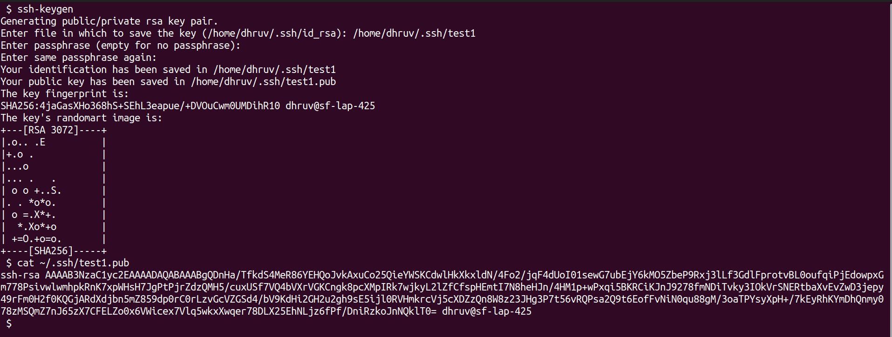
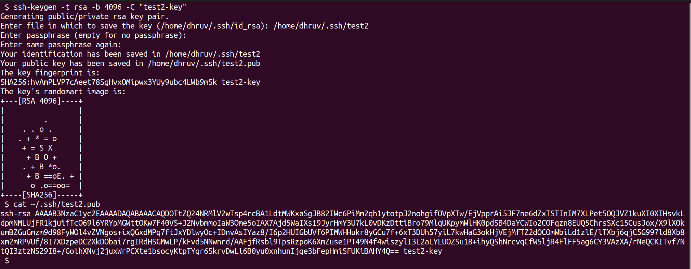
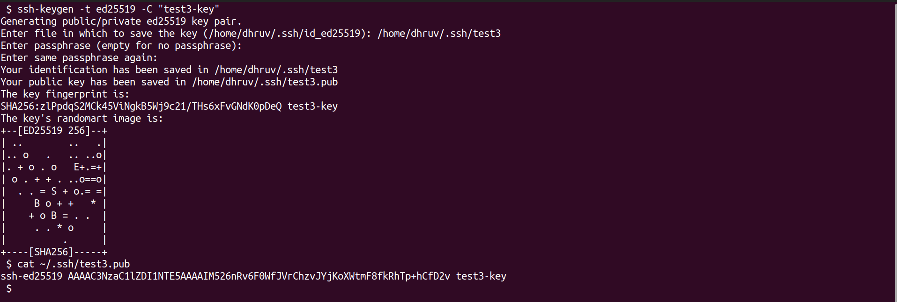

# Assignment2 - Generate SSH Key

To generate SSH Key pair we use `ssh-keygen` command

````bash
# To generate an SSH-Key pair with 
# - Default key generation Algorithm as "RSA"
ssh-keygen
````



````bash
# To generate an SSH-Key pair with 
# - "RSA" as Key generation Algorithm
# - "4096" bits key length
# - "key-identifier-comment" as Comment for the Key (Typically it will be an Email-Address)

ssh-keygen -t rsa -b 4096 -C "key-identifier-comment"
````



> If we don't provide Key Identifier Comment, it will take System's name as a Comment

````bash
# To generate an SSH-Key pair with
# - "ED25519" as Key generation Algorithm
# - "key-identifier-comment" as Comment for the Key (Typically it will be an Email-Address)

ssh-keygen -t ed25519 -C "key-identifier-comment"
````



> ED25519 is better algorithm than RSA for SSH-Key generation
> - It generates more secure key
> - Smaller size for the Key
> - Faster Key generation

## Use of the SSH-Key pair

SSH-Key pair is made up of **Private Key** and **Public Key**

- Private Key will reside on SSH-Client
- Public Key will be shared with SSH-Server

for Encrypted Communication Channel establishment